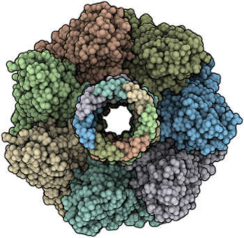

  

<h1 align="center">Model3DBio Group</h1>
                                                                                                        
📌 The **Structural Bioinformatics, Modelling and Biological Mechanisms Group** (Model3DBio) is part of the Institute of Grapevine and Wine Sciences (ICVV), a joint research center governed by the Spanish National Research Council (CSIC), the Government of La Rioja, and the University of La Rioja. Our multidisciplinary team includes experts in Bioinformatics, Biochemistry, Physics, and Computer Science, specializing in statistical, mathematical, engineering, and biological modeling.

The main objective of the group is the development and application of computational methods for the structural modeling of biomolecules and biological mechanisms relevant to viticulture and oenology. We aim to understand and rationally manipulate biomolecular processes related to wine, covering everything from metabolite biosynthesis in grapevines and their transformation in fermentation microorganisms to their effects on human health.

---

## 🔬 Research Lines

Our work is organized into three main research lines:

### 1. Development of Multiscale Computational Methods

* **1.1 Modeling of Biomolecular Interactions:**

  * Development of energy functions and artificial intelligence techniques to study complexes such as antibody-antigen, multiprotein assemblies, and association dynamics.
* **1.2 Impact of Mutations on Protein Binding:**

  * Evaluation of changes in affinity and stability of protein-protein complexes using energy potentials combined with machine learning.
* **1.3 Analysis of Biological Data and Probabilistic Modeling:**

  * Modeling of dynamics at the cellular and population levels through statistical and probabilistic approaches.
* **1.4 Validation and Implementation:**

  * Rigorous testing of developed methods, with deployment of web servers for use by the scientific community.

### 2. Applications in Wine Sciences

* **2.1 Molecular Targets Related to Wine Polyphenols:**

  * Identification and structural modeling of potential biomolecular targets with protective or therapeutic activity.
* **2.2 Quality Determinants and Sensory Perception Mechanisms:**

  * Analysis of molecular bases of wine compounds and simulation of interactions explaining taste and aroma sensations.
* **2.3 Enzymes and Biomolecules in Yeasts and Winemaking Processes:**

  * Design and stabilization of key enzymes in fermentation and oenological processes to optimize performance and quality.
* **2.4 Modeling of Grapevine Proteins and Genetic Variants:**

  * Computational structuring of *Vitis vinifera* proteins and molecular-level study of genetic polymorphisms linked to agronomic or quality traits.

### 3. Experimental Validation and Search for New Compounds

* **3.1 In Vitro Validation of Anthocyanins and Dietary Polyphenols:**

  * Biochemical and cellular assays to verify the biological activity of grape-derived compounds.
* **3.2 Structural and Biochemical Analysis of Molecular Mechanisms:**

  * In-depth investigations of how polyphenols and other compounds interact with their targets, using crystallography, NMR, or molecular dynamics simulations.

---

## 👥 Research Team

### Scientific Direction

* **J. Fernández-Recio (PI)**

  * Professor/Principal Investigator (CSIC). Recognized in 2024 as one of the world's most influential scientists (“Top 2%” by Stanford).

### Postdoctoral Researchers

* **L. A. Rodríguez-Lumbreras**
* **A. Jiménez-Panizo**

### PhD Students

* **J. Blecua-Pérez** (4th year)
* **V. Monteagudo-Honrubia** (1st year)

---

## 🛠 Tools and Web Services

Some portals and servers we maintain for the community:

* [**CCharPPI**](https://life.bsc.es/pid/ccharppi)
  Computational Characterisation of Protein–Protein Interactions.
  
* [**OPRA Server**](https://life.bsc.es/pid/opra)
  OPRA (Optimal Protein–RNA Area): identifies potential RNA-binding sites on proteins and facilitates modeling of biologically or therapeutically relevant protein–RNA interactions.
 
* [**Protein–RNA Benchmark v1.0**](https://life.bsc.es/pid/protein-rna-benchmark/)
  Dataset of 106 cases for benchmarking protein–RNA docking (unbound–unbound, unbound–bound, model–bound, etc.).

* [**pyDockWEB**](https://life.bsc.es/pid/pydock/)
  Fast protocol using electrostatics and desolvation energy to score FFT-generated docking conformations.

* [**pyDockEneRes**](https://life.bsc.es/pid/pydockeneres)
  Calculates per-residue energy contributions in protein–protein interactions.

* [**pyDockRescoring**](https://life.bsc.es/pid/pydockrescoring)
  Web service for rescoring jobs from the pyDockWEB server.

* [**pyDockSAXS**](https://life.bsc.es/pid/pydocksaxs)
  Rigid-body protein–protein docking server integrating SAXS experimental data to refine predictions.

* [**pyDockWEB**](https://life.bsc.es/pid/pydockweb)
  Web server for structural prediction of protein–protein interactions via computational docking.
  
* [**pyDockDNA**](https://model3dbio.csic.es/pydockdna)
  Web server for structural prediction of protein–DNA interactions using computational docking.

* [**SKEMPI 2.0**](https://life.bsc.es/pid/skempi2)
  Database of 7000+ protein–protein mutation data, including thermodynamic and kinetic binding changes with available interaction structures.
---

## 📈 How to Collaborate

If you're interested in collaborating with us, contributing resources, or just staying informed:

1. **Fork the repository**: Click “Fork” and work on a new branch.
2. **Issues**: Open “Issues” to suggest improvements, report bugs, or propose new developments.
3. **Pull Requests**: When ready, submit a “Pull Request” briefly describing your changes.
4. **Direct Contact**:

   * **J. Fernández-Recio (PI):** [juan.fernandezrecio@icvv.es](mailto:juan.fernandezrecio@icvv.es)
   * **L. A. Rodríguez-Lumbreras:** [luisangel.rodriguez@icvv.es](mailto:luisangel.rodriguez@icvv.es)
   * **V. Monteagudo-Honrubia:** [victor.monteagudo@icvv.es](mailto:victor.monteagudo@icvv.es)

---
### Version en Español
---
## 📌 Acerca del Grupo

El **Structural Bioinformatics, Modelling and Biological Mechanisms Group** (Grupo de Bioinformática Estructural, Modelado y Mecanismos Biológicos) forma parte del Instituto de Ciencias de la Vid y el Vino (ICVV), un centro mixto gobernado por el Consejo Superior de Investigaciones Científicas (CSIC), el Gobierno de La Rioja y la Universidad de La Rioja. Nuestro equipo multidisciplinar agrupa expertos en Bioinformática, Bioquímica, Física e Informática especializados en modelado estadístico, matemático, ingenieril y biológico.

El objetivo principal del grupo es el desarrollo y aplicación de métodos computacionales para el modelado estructural de biomoléculas y mecanismos biológicos de interés en viticultura y enología. Buscamos comprender y manipular de manera racional los procesos biomoleculares relacionados con el vino, abarcando desde la biosíntesis de metabolitos en la vid y su modificación en microorganismos de vinificación, hasta sus efectos en la salud humana.

---

## 🔬 Líneas de Investigación

Nuestras labores se organizan en tres líneas de investigación principales:

### 1. Desarrollo de Métodos Computacionales Multiescala

* **1.1 Modelado de Interacciones Biomoleculares:**

  * Construcción de funciones energéticas y técnicas de inteligencia artificial para entender complejos como anticuerpo-antígeno, ensamblajes multiproteicos y dinámicas de asociación.
* **1.2 Impacto de Mutaciones en Unión Proteica:**

  * Evaluación de cambios en la afinidad y estabilidad de complejos proteína-proteína usando potenciales energéticos combinados con aprendizaje automático.
* **1.3 Análisis de Datos Biológicos y Modelado Probabilístico:**

  * Modelización de dinámicas a nivel celular y poblacional mediante aproximaciones estadísticas y probabilísticas.
* **1.4 Validación e Implementación:**

  * Comprobación rigurosa de los métodos desarrollados, con despliegue de servidores web para su uso por la comunidad científica.

### 2. Aplicaciones en Ciencias del Vino

* **2.1 Dianas Moleculares Relacionadas con Polifenoles del Vino:**

  * Identificación y modelado estructural de posibles blancos biomoleculares con actividad protectora o terapéutica.
* **2.2 Determinantes de Calidad y Mecanismos de Percepción Sensorial:**

  * Análisis de bases moleculares de compuestos del vino y simulación de interacciones que explican sensaciones gustativas u olfativas.
* **2.3 Enzimas y Biomoléculas en Levaduras y Procesos de Vinificación:**

  * Diseño y estabilización de enzimas clave en la fermentación y en procesos enológicos, para optimizar rendimiento y calidad.
* **2.4 Modelado de Proteínas de la Vid y Variantes Genéticas:**

  * Estructuración computacional de proteínas de *Vitis vinifera* y estudio a nivel molecular de polimorfismos genéticos asociados a rasgos agronómicos o de calidad.

### 3. Validación Experimental y Búsqueda de Nuevos Compuestos

* **3.1 Validación In Vitro de Antocianinas y Polifenoles Dietéticos:**

  * Ensayos bioquímicos y celulares para corroborar la actividad biológica de compuestos derivados de la vid.
* **3.2 Análisis Estructural y Bioquímico de Mecanismos Moleculares:**

  * Investigaciones detalladas de cómo los polifenoles y otros compuestos interactúan con sus blancos, mediante cristalografía, RMN o simulaciones de dinámica molecular.

---

## 👥 Equipo de Investigación

### Dirección Científica

* **J. Fernández-Recio (PI)**

  * Catedrático/Investigador Titular (CSIC). Reconocido en 2024 como uno de los científicos más influyentes a nivel mundial (“Top 2%” de Stanford).

### Investigadores Postdoctorales

* **L. A. Rodríguez-Lumbreras**
* **A. Jiménez-Panizo**

### Estudiantes de Doctorado

* **J. Blecua-Pérez** (4.º año)
* **V. Monteagudo-Honrubia** (1.º año)
---

## 🛠 Herramientas y Servicios Web

Algunos de los portales y servidores que mantenemos para la comunidad:

* [**CCharPPI**](https://life.bsc.es/pid/ccharppi)
  Computational Characterisation of Protein–Protein Interactions.
  
* [**OPRA Server**](https://life.bsc.es/pid/opra)
  OPRA (Optimal Protein–RNA Area): identifica posibles sitios de unión a ARN en proteínas y facilita el modelado de interacciones proteína–ARN de interés biológico o terapéutico.
  
* [**Protein–RNA Benchmark v1.0**](https://life.bsc.es/pid/protein-rna-benchmark/)
  Conjunto de datos compuesto por 106 casos para benchmarking de docking proteína–ARN (unbound–unbound, unbound–bound, model–bound, etc.).

* [**pyDockWEB**](https://life.bsc.es/pid/pydock/)
  Protocolo rápido que utiliza energía electrostática, Van der Waals y desolvatación para puntuar conformaciones de docking generadas con algoritmos FFT.

* [**pyDockEneRes**](https://life.bsc.es/pid/pydockeneres)
  Calcula energía por residuo para interacciones proteína–proteína.

* [**pyDockRescoring**](https://life.bsc.es/pid/pydockrescoring)
  Servicio web para rescoring de trabajos realizados con el servidor pyDockWEB.

* [**pyDockSAXS**](https://life.bsc.es/pid/pydocksaxs)
  Servidor de docking rígido proteína–proteína que integra información experimental de SAXS para refinar las predicciones.

* [**pyDockWEB**](https://life.bsc.es/pid/pydockweb)
  Servidor web para la predicción estructural de interacciones proteína–proteína mediante docking computacional.

* [**pyDockDNA**](https://model3dbio.csic.es/pydockdna)
  Servidor web para la predicción estructural de interacciones proteína–proteína mediante docking computacional.
  
* [**SKEMPI 2.0**](https://life.bsc.es/pid/skempi2)
  Base de datos con más de 7000 datos de mutaciones que incluyen cambios en parámetros termodinámicos y cinéticos de unión proteína–proteína cuando la estructura de la interacción está disponible en el PDB.

---

## 📈 Cómo Colaborar

Si te interesa colaborar con nosotros, donar recursos, o simplemente estar al tanto de nuestras últimas novedades:

1. **Fork del repositorio**: Haz click en “Fork” y trabaja en una rama nueva.
2. **Issues**: Abre “Issues” para sugerir mejoras, reportar bugs o proponer nuevos desarrollos.
3. **Pull Requests**: Cuando tengas cambios listos, crea un “Pull Request” describiendo brevemente lo implementado.
4. **Contacto directo**:

   * **J. Fernández-Recio (PI):** [juan.fernandezrecio@icvv.es](mailto:juan.fernandezrecio@icvv.es)
   * **L. A. Rodríguez-Lumbreras:** [luisangel.rodriguez@icvv.es](mailto:luisangel.rodriguez@icvv.es)
   * **V. Monteagudo-Honrubia:** [victor.monteagudo@icvv.es](victor.monteagudo@icvv.es)

